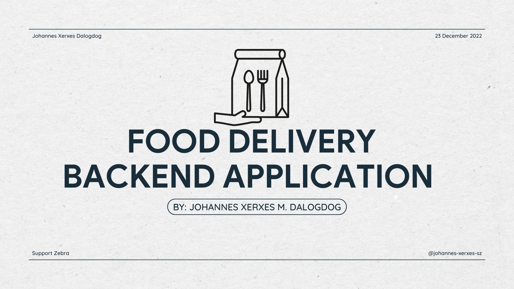

# Food Delivery Backend Application  [](https://github.com/johannes-xerxes-sz/backend-capstone-final/)

Food Delivery Backend Application 

## Table of contents
* [General info](#general-info)
* [Project Demo](#project-demo)
* [Project Video](#project-video)
* [Technologies](#technologies)
* [Setup](#setup)
* [Features](#features)
* [Inspiration](#inspiration)
* [Contact](#contact)
* [License](#license)

## General info
A backend application program with the listed features would likely be a web-based application that allows users to perform create, read, update, and delete (CRUD) operations on information related to food, restaurants, and menus. This could include creating and updating listings for different types of food, restaurants, and menus, as well as deleting outdated or inaccurate information.
The program may also include integration with the Stripe payment system, which would allow users to make payments through the application using various payment methods.
In addition, the program may include a feature that allows users to check the weather in a particular location, using data from a weather API or other source.
Finally, the program may include a live location feature that allows users to track their location in real-time, either through GPS or other location tracking technologies. This could be useful for a variety of purposes, such as tracking the location of delivery drivers or helping users find their way to a particular restaurant.

<div align="center">Welcome to Food Delivery Backend Application! </div>
<br/>
<div align="center">
<kbd>

</kbd>
</div>

<br/>
<div align="center">
<kbd>

</kbd>
</div>

## Project Demo 
[Click to view video demo]([https://bug-view.herokuapp.com/login](https://youtube.com))

## Project Video
[Click to view demo of BugView](https://youtube.com)

## Technologies
### Backend Development 
* Node.js - version 14.6.0
* Express - version 4.17.1
* Express-Validator - version 6.6.1
* Config - version 3.3.2
* JWT - version 8.5.1
* Mongoose - version 5.10.0
* Request - version 2.88.2

## Setup
To try out this project: 
1. Clone the GitHub repository locally to your computer
1. In the command line, navigate to the root directory of the repository, and type the following: 
  $ npm install 
1. Navigate to the client folder, and in the root directory of the client folder, type the following: 
  $ npm install 
1. In the client folder, and in the root directory of the client folder, type the following: 
  $ npm start
1. Navigate back to the root directory of this project "/GitConnect" and start the server by typing the following: 
  $ npx nodemon server 

## Code Examples
### Node.js/Express.js
```Node

```


## Features
* Full stack web application utilizing: MongoDB, Express.js, React, Stripe, mapbox, jwt, openweather, and Node.js. 


## Status
Project is: finished on the backend side but needed to add for the additional models .

## Inspiration
I am on a journey to create a software program that will make a real impact in the world, and I am driven by my love of food. Whether I am cooking a delicious meal or building a software program, I am always striving to create something special. I know that building a software program is like building a puzzle, and it's up to me to bring all the pieces together. I stay focused, stay true to my vision, and never give up. I know that with hard work, dedication, and a little bit of inspiration, I can achieve anything I set my mind to, even if it's just cooking the perfect meal.

## Contact
Created by [Johannes Xerxes M. Dalogdog](https://www.linkedin.com/in/johannes-xerxes-dalogdog-878b331a7) 
Feel free to contact me for any questions! 

## License
[Click to view](https://github.com/johannes-xerxes-sz/backend-capstone-final/blob/master/LICENSE)

## Contributing

Pull requests are welcome. For major changes, please open an issue first
to discuss what you would like to change.

Please make sure to update tests as appropriate.
